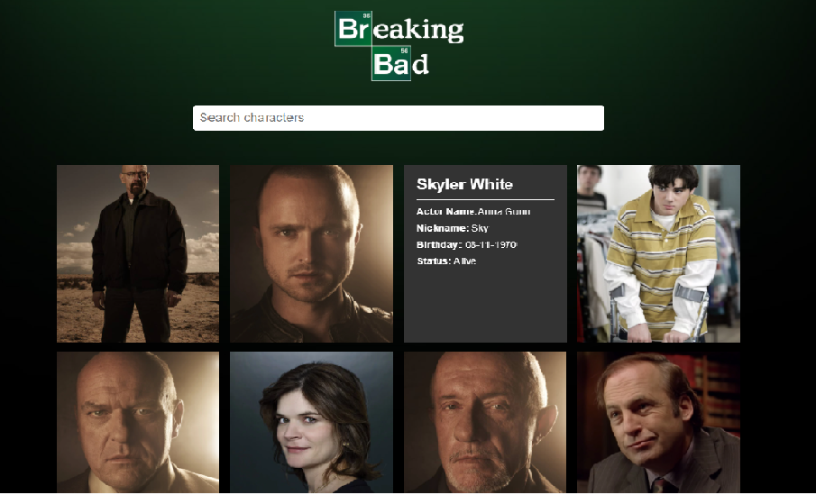

# Breacking Bad Api


## Table of Contents

 - [Website interface](#website-interface)
 - [Description](#description)
 - [Build Tools](#build-tools)
 - [Installation](#installation)

 ---

### Website interface





_____

## Description
This small website with **React** and one of my favorite show API [Breaking Bad](https://breakingbadapi.com/documentation) with
**Traversy Media** 
  
  
###### [Back To The Top](#breacking-bad-api)

---


## Build Tools
* HTML
* CSS
* JavaScript
* React
* Breacking-Bad API


###### [Back To The Top](#breacking-bad-api)
---
## Installation

1. Move to the project folder
```
cd <project directory>
```
2. Clone the repo
```
git clone https://github.com/Siham2000/Breaking-Bad.git
```
3.Install
```
npm i


